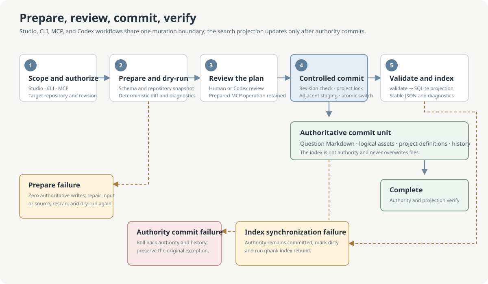
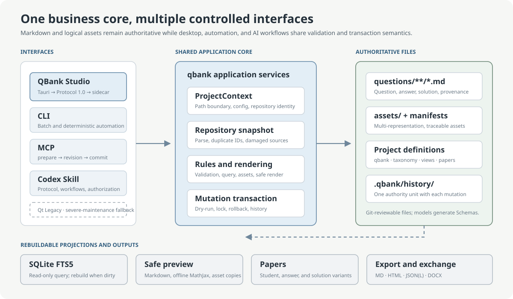
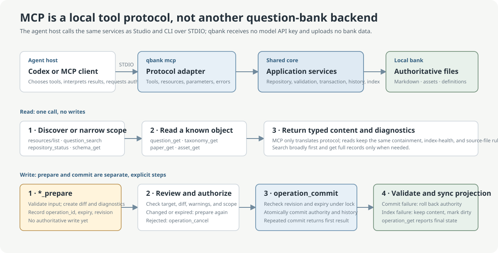
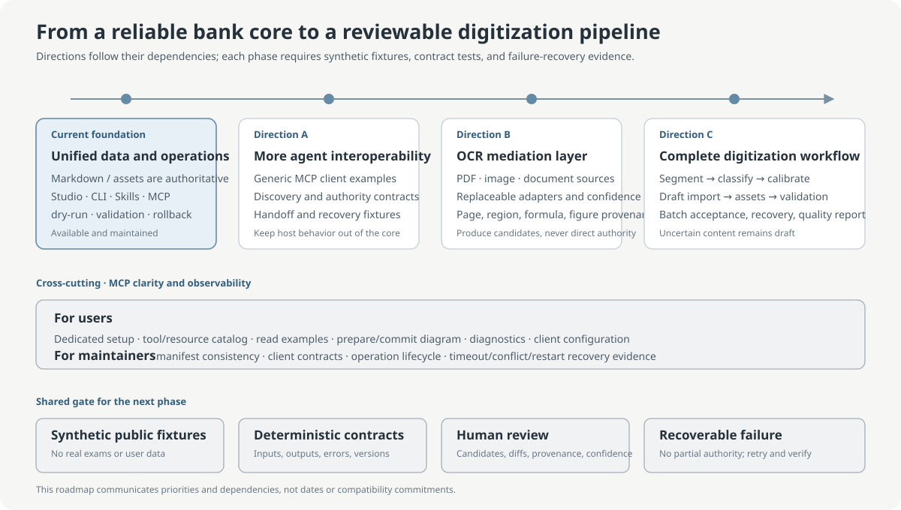

# qbank

[简体中文](README.md) · [English](README.en.md) · [Documentation](docs/README.md)


qbank began with a practical gap: existing question-bank tools rarely provide coding agents with a
reviewable, reversible interface while keeping data in ordinary files. The project therefore gives
people, desktop software, command-line automation, and coding agents one shared set of Schemas,
validation rules, and transaction boundaries.

> **AI coding disclosure:** all code, tests, documentation, and interface iterations in this
> repository have been generated or modified through coding agents. The maintainer defines
> requirements, approves designs, reviews results, and authorizes releases. This records the
> development method; reproducible tests, review evidence, and artifact verification remain the
> basis for security and correctness claims.

`qbank` is a local-first structured question-bank system for reliable human–AI collaboration.
Questions are durable Markdown files with YAML front matter; JSON and JSONL are exchange formats;
SQLite is only a rebuildable search projection; and `paper.yaml` describes reviewable, reproducible
papers.

> **Current version:** the current pre-release is `0.3.0-beta.2` (Python package `0.3.0b2`).
> `0.2.x` remains the previous compatibility-maintenance line, with its Qt desktop application now
> classified as QBank Studio Legacy. `0.1.x` is unsupported. Question, Asset, and Paper Schemas
> remain at `1.0`.

> **Unsigned beta:** the Windows installer and portable package are not code-signed. SmartScreen
> may warn. Download only from this repository's Release and verify SHA-256 against
> `checksums.txt` before running either artifact.

<picture>
  <source media="(prefers-color-scheme: dark)" srcset="docs/assets/readme/studio-main-dark.png">
  
</picture>

<p align="center"><sub>The current Tauri Studio is shown with a public synthetic fixture; the screenshot contains no real questions or machine-local path.</sub></p>

| Interface | Best for | Start with |
| --- | --- | --- |
| QBank Studio | Browsing, editing, tags, assets, and paper composition | Windows installer or portable archive |
| CLI | Batch import, validation, queries, export, and automation | `qbank --help` |
| Codex Skill / MCP | Codex collaboration under the same data boundary | `qbank codex integration-status --format json` |
| QBank Studio Legacy | Qt fallback for severe compatibility, security, or data-loss defects | `qbank desktop` |

## Purpose and capabilities

qbank serves individuals and small teams who want questions to remain ordinary, versionable files
while desktop editing, command-line automation, and AI tools share the same validation and transaction
rules. It provides structured questions, deterministic validation, filters and full-text search,
managed assets, reproducible paper variants, and multiple export formats. It is not an online exam
service, account system, learning-record store, automatic grader, OCR engine, or embedded model service.

## QBank Studio desktop editor

QBank Studio is the modern Tauri presentation adapter under `apps/studio/`. It can be packaged and
installed independently, but it does not maintain a second question-bank implementation. The left
navigation organizes questions, saved views, filters, and explicit batch selection. The central
workspace switches among source, split, and instant-render modes. The right Inspector edits
properties and presents assets and history. Vditor, MathJax, and preview resources ship with the
application for offline Markdown/TeX editing and formula rendering.


<p align="center"><sub>The logical-asset menu enables operations from actual capabilities and keeps unsupported actions visibly disabled.</sub></p>

The Qt client is now named QBank Studio Legacy and remains available through `qbank desktop`.
Both clients share repository formats, locks, transactions, history, and indexes without an
irreversible migration. Legacy is a maintenance fallback; it does not represent the current
Studio interface, screenshots, or default workflow. See the [Studio guide](docs/en/desktop-editor.md), the
[monorepo development guide](docs/monorepo-development.md), and the
[design system](docs/ui/design-system.md).

## Unified repository development

The Python package, CLI, MCP, Skills, Studio sidecar, Tauri app, and Qt Legacy client live in one
Git repository. Ordinary changes run affected fast checks. Integration checks run only when
Protocol, writes, editor, permissions, or installation boundaries change. Release checks are
reserved for a version freeze or formal publication.

```powershell
python scripts/check.py fast
python scripts/check.py integration
python scripts/build.py wheel
python scripts/build.py studio
python scripts/build.py all
```

## Quick start

```powershell
py -3.11 -m venv .venv
.venv\Scripts\Activate.ps1
python -m pip install -U pip setuptools wheel
pip install .

qbank init demo-bank
Set-Location demo-bank
qbank doctor --format json
```

`examples/public-demo/` is entirely self-authored and contains no real examination or user-bank
material. Verify a Release wheel against the Release checksum before installing it:

```powershell
Get-FileHash .\qbank-0.3.0b2-py3-none-any.whl -Algorithm SHA256
pip install .\qbank-0.3.0b2-py3-none-any.whl
```

Windows desktop users can download `QBank-Studio-0.3.0-beta.2-x64-setup.exe` or the portable ZIP.
See the [installation and upgrade guide](docs/en/installation.md) for verification, upgrades, and
the Legacy fallback.

For development, install all quality and Studio test dependencies with
`pip install -e ".[dev,studio-dev]"`.

## Safe write workflow



Every authoritative write follows one sequence: inspect the Schema or current record, run a dry-run,
review the result, commit the identical operation, and validate. Index synchronization follows the
Markdown/history commit. An index failure leaves authoritative content committed, creates a dirty
marker, and requires explicit rebuild.

```powershell
qbank schema --format json
qbank ingest ..\examples\questions.jsonl --dry-run --format json
qbank ingest ..\examples\questions.jsonl --format json
qbank validate --format json
```

Do not edit `questions/**/*.md` directly by default and never edit `.qbank/index.sqlite` manually.
Ordinary writes and `--upsert` do not overwrite damaged Markdown.

## Data boundary and architecture



The layers in the diagram also describe source dependency direction:

1. `apps/studio/`, `src/qbank/commands/`, `src/qbank/mcp/`, and `qbank.legacy_qt` are peer
   presentation adapters.
2. They call `src/qbank/application/`, domain models, and infrastructure ports without duplicating
   question rules.
3. `$qbank`, `$qbank-digitize`, and `$qbank-deliver` provide protocol and domain workflows;
   authoritative access still goes through the shared CLI/MCP services.
4. The shared core operates authoritative files only inside a confirmed bank root.

Within that root, `questions/` contains authoritative question Markdown, `assets/` contains managed
resources and manifests, `qbank.yaml`, taxonomy, views, and papers contain project definitions, and
`.qbank/history/` commits with authoritative mutations. `.qbank/index.sqlite`, previews, build
directories, and exports are rebuildable or regenerable. Pydantic models generate JSON Schema; no
handwritten second copy is maintained.

HTTP, HTTPS, and `//host` images are allowed with `external_asset` warnings. Absolute, `file:`,
`data:`, and escaping paths are rejected. Jinja templates execute in a sandbox, but custom templates
remain a user-reviewed trust boundary.

## Common workflows

```powershell
qbank query --subject optics --status reviewed `
  --fields id,title,subject,chapter,topics,type,difficulty,status `
  --format json
qbank search "optical path" --format json
qbank get OPT-INT-0001 --format json

qbank tag list --format json
qbank view list --format json

qbank schema --kind asset-package --format json
qbank asset ingest OPT-INT-0001 build\ai\asset-package.json --dry-run --format json
qbank asset validate --format json

qbank paper validate papers\generated\optics-test.yaml --format json
qbank paper build papers\generated\optics-test.yaml --format md `
  --output exports\optics-test-student.md
```

DOCX uses the system Pandoc executable; Markdown and HTML remain available when Pandoc is missing.

## Codex integration

New banks include `$qbank`, the deterministic repository communication protocol, plus separate
`$qbank-digitize` and `$qbank-deliver` domain guides for source calibration and read-only formal
document construction. Codex Desktop,
IDE, or CLI can use these rules with local commands, or call the same services through optional
STDIO MCP. qbank itself needs no OpenAI API key.

```powershell
qbank codex check --format json
qbank codex instructions --format markdown
qbank codex install-skill --skill qbank --user --dry-run --format json
qbank codex install-skill --skill qbank-digitize --user --dry-run --format json
qbank codex install-skill --skill qbank-deliver --user --dry-run --format json
qbank codex install-mcp --project --dry-run --format json
qbank codex integration-status --format json
```

For source digitization, `$qbank-digitize` organizes existing MinerU output into
`questions.jsonl`, Asset packages, and a `review.md` containing only unresolved items. `$qbank`
then uses existing MCP operations to prepare, inspect, commit, and validate the authoritative
changes. `$qbank-deliver` freezes Question JSONL and Asset manifests from the same MCP read tools,
then uses the original `qbank-zh-exam-v1` template for student, answer, or solution PDFs.
The fully synthetic
[lightweight end-to-end example](examples/workflows/lightweight/README.md)
demonstrates checking, MCP import, query, snapshot, and TeX build in a new directory without
reading an existing bank.

MCP requires the separate `qbank[mcp]` extra. Its absence or lack of registration does not affect
CLI, Studio, or Skills. It is a local STDIO adapter bound to one bank, not a remote backend: read
tools call shared application services, while every write first calls `*_prepare` to receive a
diff, expiry, and `repository_revision`, then calls `operation_commit` after review. Commit refuses
a repository that changed between the calls, and `operation_get` recovers durable state after
restart or response loss. See the [MCP guide](docs/en/mcp-guide.md) for setup, the tool and resource
catalog, complete read/write examples, diagnostics, and the security boundary.



## Roadmap



Planned work follows three lightweight, independent directions:

- test real configuration, discovery, authority, conflict, and recovery with more agent hosts that
  support local tool protocols;
- reuse existing MinerU output in source projects so AI and `$qbank-digitize` can generate Question
  JSONL, Asset packages, and a `review.md` containing only unresolved items before existing
  two-phase MCP writes;
- query and read through existing MCP, then let AI and `$qbank-deliver` generate `selection.yaml`
  and TeX for a fixed template and `latexmk` / XeLaTeX.

qbank does not embed MinerU, build a generic Candidate database, job-state platform, or complete
publishing system, or change Schemas, MCP tools, or core architecture for this work. Unconfirmed
content remains `draft`. See the [project roadmap](docs/en/roadmap.md) for scope and acceptance.

## Documentation

| Document | Contents |
| --- | --- |
| [English documentation home](docs/en/README.md) | Complete English navigation |
| [User guide](docs/en/user-guide.md) | Daily data and command workflows |
| [CLI reference](docs/en/cli-reference.md) | Public commands and automation boundaries |
| [Studio guide](docs/en/desktop-editor.md) | Desktop interaction and resource behavior |
| [Monorepo development](docs/monorepo-development.md) | Repository layout, tiered checks, impact mapping, and unified builds |
| [Codex and MCP](docs/en/codex-integration.md) | Communication, digitization/delivery Skills, cross-project context, MCP, and authorization |
| [MCP guide](docs/en/mcp-guide.md) | MCP role, setup, tools and resources, two-phase writes, diagnostics, and security |
| [Project roadmap](docs/en/roadmap.md) | Multi-agent tests, lightweight source ingestion, TeX delivery, and future MCP work |
| [Source → qbank → formal deliverables](docs/en/source-qbank-deliverables.md) | Lightweight requirements built from MinerU, AI, existing MCP, and fixed TeX templates |
| [0.2.0 compatibility reference](docs/en/compatibility-0.2.0.md) | CLI, Schema, MCP, diagnostics, and capabilities for that release |
| [Compatibility policy](docs/en/compatibility-policy.md) | Stable interfaces and release rules |
| [0.2.0 known limitations](docs/en/known-limitations-0.2.0.md) | Filesystem, transaction, performance, and product limits |
| [Architecture](docs/architecture.md) | Layers, ownership, transactions, and extension boundaries |

All commands provide `--help`. Machine-readable output belongs on stdout; human diagnostics belong
on stderr. Use `--format json` for automation.

## Current limitations

- The current beta does not promise a stable third-party Python API. The documented CLI, Schemas,
  Markdown, and JSON fields follow the current compatibility matrix and policy.
- LaTeX validation is structural and does not run a TeX compiler.
- CLI-generated HTML preview uses the MathJax CDN; modern Studio ships its formula resources for
  offline rendering.
- `--changed` requires a usable Git worktree and otherwise falls back to full validation.
- Local conventional filesystems are the supported deployment model. Network drives, synchronized
  folders, and multi-machine concurrent writes are outside the safety commitment.
- qbank is not an online exam service, OCR engine, automatic question selector, embedded Studio
  chat, or model API wrapper.

See the [0.3.0-beta.2 known limitations](docs/en/known-limitations-0.3.0-beta.2.md) for the complete
runtime and deployment boundary.

## License

qbank is released under the [MIT License](LICENSE). Licenses for embedded resources are documented
separately in the [Tauri Studio notices](apps/studio/THIRD_PARTY_NOTICES.md) and
[Qt Legacy notices](src/qbank/resources/desktop/THIRD_PARTY_NOTICES.md).

## Open-source acknowledgements

qbank directly uses the following open-source projects. Lock files and the third-party notices are
the authority for exact versions and transitive dependencies.

- [Tauri](https://github.com/tauri-apps/tauri) provides the modern desktop shell and packaging;
  [Vditor](https://github.com/Vanessa219/vditor), [MathJax](https://github.com/mathjax/MathJax),
  and [KaTeX](https://github.com/KaTeX/KaTeX) support Markdown/TeX editing and presentation.
- [markdown-it-py](https://github.com/executablebooks/markdown-it-py),
  [Jinja](https://github.com/pallets/jinja), [Pydantic](https://github.com/pydantic/pydantic),
  [Typer](https://github.com/fastapi/typer), and [Rich](https://github.com/Textualize/rich)
  support parsing, templates, data contracts, and the CLI.
- [SQLite](https://www.sqlite.org/), [Pandoc](https://github.com/jgm/pandoc), and
  [Ipe](https://github.com/otfried/ipe) provide rebuildable search, document conversion, and
  editable-graphics workflows.
- [PySide6 / Qt for Python](https://doc.qt.io/qtforpython-6/),
  [CodeMirror](https://github.com/codemirror/dev/), and
  [QtAwesome](https://github.com/spyder-ide/qtawesome) support QBank Studio Legacy.

Product design also learned from the public question organization, reuse, and authoring practices
of [Moodle Question Bank](https://github.com/moodle/moodle) and
[Open edX](https://github.com/openedx/openedx-platform). Those projects neither endorse nor are
affiliated with qbank; this acknowledgement does not imply that their code or data formats were
copied.
The AI-provenance label format was informed by
[made-by-ai](https://github.com/mefengl/made-by-ai) and
[ai-badges](https://github.com/40ants/ai-badges). qbank ships its own SVG and does not rely on a
remote badge service.
