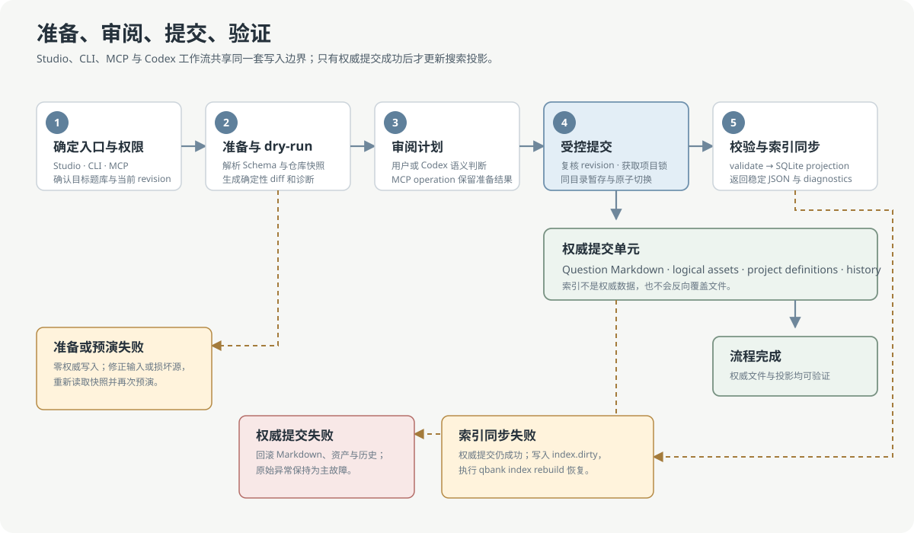
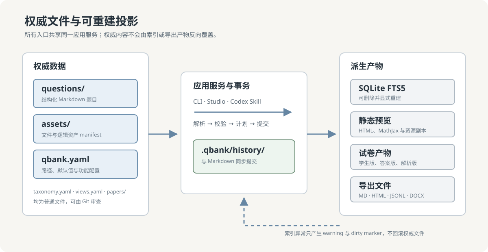

# qbank

[简体中文](README.md) · [English](README.en.md) · [文档中心](docs/README.md)

`qbank` 是一个本地优先、面向人机协作的结构化题库工具。题目以带 YAML front matter
的 Markdown 文件长期保存；JSON/JSONL 用于交换；SQLite 仅承担可重建的全文检索投影；
`paper.yaml` 用于描述可审查、可复现的试卷结构。

> **版本状态：** `v0.2.0` 是不可变发布基线；当前预发布为 `0.3.0-beta.1`
> （Python 包 `0.3.0b1`）。Question、Asset、Paper Schema 仍为 `1.0`。
> Markdown 是题目内容的唯一权威来源，索引、预览和导出产物均可重建。

> **Unsigned beta：** 本版 Windows 安装器和便携包尚未代码签名，SmartScreen 可能显示
> 警告。仅从本仓库 Release 下载，并在运行前使用随附 `checksums.txt` 核对 SHA-256。

<picture>
  <source media="(prefers-color-scheme: dark)" srcset="docs/assets/readme/studio-main-dark.png">
  
</picture>

<p align="center"><sub>当前 Tauri Studio 使用公开合成 fixture 展示源码、离线公式预览、结构化属性与逻辑资产；截图不包含真实题目或本机路径。</sub></p>

| 使用入口 | 适用场景 | 启动方式 |
| --- | --- | --- |
| QBank Studio | 日常浏览、编辑、标签整理、资源管理和组卷 | Windows 安装器或便携包 |
| CLI | 批量导入、校验、查询、导出和自动化 | `qbank --help` |
| Codex Skill / MCP | 让 Codex 在相同数据边界内协作 | `qbank codex integration-status --format json` |
| QBank Studio Legacy | Qt 维护回退，仅处理严重兼容、安全或数据损坏问题 | `qbank desktop` |

## 项目定位

qbank 面向希望将题目长期保存在普通文件中，同时让桌面编辑、命令行自动化和 AI 工具共享
同一套数据边界的个人与小型团队。它不提供在线考试、用户账号、学习记录、自动判题、OCR
或内置模型服务。

## 核心功能

核心能力包括：

- 使用结构化 Markdown 保存题目、答案、解析、评分要点和来源信息；
- 对单题、批量导入和结构化修订执行确定性校验；
- 通过字段、标签、保存视图和 SQLite FTS5 检索题目；
- 管理本地图片、外部引用和带多种表示的逻辑资产；
- 构建学生版、答案版和解析版试卷；
- 导出 Markdown、HTML、JSON、JSONL、纯文本和 DOCX；
- 通过 Studio、CLI、Codex Skill 与可选 MCP 复用同一应用服务和事务边界。

## QBank Studio 桌面编辑器

QBank Studio 是位于同一仓库 `apps/studio/` 的现代 Tauri presentation adapter，可独立
打包和安装，但不维护第二份题库实现。左侧导航组织题目、保存视图、筛选与批量选择；中央
工作区在源码、分栏和即时渲染模式之间切换；右侧 Inspector 编辑属性并呈现资产与历史。
Vditor、MathJax 和预览所需资源随应用打包，可离线完成 Markdown/TeX 编辑与公式渲染。

图片按文档对象处理。可用操作由资源类型和实际表示决定；本地文件必须通过题库边界校验，
外部资源保持只读并显示警告。Studio 保存仍执行与 CLI 相同的 dry-run、提交、校验和索引同步。


<p align="center"><sub>深色模式下的逻辑资产菜单按实际能力启用操作；不可用操作保持可见并明确禁用。</sub></p>

Qt 客户端已明确更名为 QBank Studio Legacy，并继续通过 `qbank desktop` 启动；两者共享
相同题库格式、锁、事务、历史和索引，不执行不可逆迁移。Legacy 是维护回退，不代表当前
Studio 的界面、截图或默认工作流。完整交互说明见
[Studio 用户文档](docs/zh-CN/desktop-editor.md)，统一构建方式见
[单仓库开发指南](docs/monorepo-development.md)，视觉规范见
[Studio 设计系统](docs/ui/design-system.md)。

## 统一仓库开发

Python 包、CLI、MCP、Skill、Studio sidecar、Tauri 应用和 Qt Legacy 位于同一 Git 仓库。
普通改动先运行受影响模块的 fast 检查；只有 Protocol、写入、编辑器、权限或安装边界发生
变化时运行 integration；release 仅用于版本冻结和正式发布。

```powershell
python scripts/check.py fast
python scripts/check.py integration
python scripts/build.py wheel
python scripts/build.py studio
python scripts/build.py all
```

## 快速开始

安装核心 CLI 并创建题库：

```powershell
py -3.11 -m venv .venv
.venv\Scripts\Activate.ps1
python -m pip install -U pip setuptools wheel
pip install .

qbank init demo-bank
Set-Location demo-bank
qbank doctor --format json
```

仓库中的 `examples/public-demo/` 是完全自制的最小公开示例，不包含真实考试或用户题库内容。
从 Release 下载 wheel 时，应先使用同一 Release 中的 `checksums.txt` 核对 SHA-256：

```powershell
Get-FileHash .\qbank-0.3.0b1-py3-none-any.whl -Algorithm SHA256
pip install .\qbank-0.3.0b1-py3-none-any.whl
```

Windows 桌面用户可下载 `QBank-Studio-0.3.0-beta.1-x64-setup.exe` 或便携 ZIP。安装、
升级、校验和 Legacy 回退见[安装与升级指南](docs/zh-CN/installation.md)。

参与开发时安装完整质量检查和 Studio 测试依赖：

```powershell
pip install -e ".[dev,studio-dev]"
```

## 安全操作流程



所有权威写入均遵循同一过程：先读取 Schema 或现有记录，执行 dry-run 并检查差异，再正式
提交，最后运行完整校验。索引同步发生在 Markdown 与历史提交之后；索引失败不会撤销权威
内容，而是留下 dirty 标记并要求显式重建。

以批量导入为例：

```powershell
qbank schema --format json
qbank ingest ..\examples\questions.jsonl --dry-run --format json
qbank ingest ..\examples\questions.jsonl --format json
qbank validate --format json
```

结构化修订同样先预演：

```powershell
qbank patch OPT-INT-0001 --file build\ai\OPT-INT-0001.patch.json `
  --dry-run --format json
qbank patch OPT-INT-0001 --file build\ai\OPT-INT-0001.patch.json --format json
qbank validate --format json
```

不得默认直接编辑 `questions/**/*.md`，也不得手工修改 `.qbank/index.sqlite`。损坏的 Markdown
不会被普通写入或 `--upsert` 静默覆盖。

## 数据边界与架构



- `questions/` 保存权威题目 Markdown；文件名与 front matter ID 必须一致。
- `assets/` 保存受管本地资源和逻辑资产 manifest；本地路径不得逃逸题库边界。
- `.qbank/history/` 与 Markdown 写入构成同一权威提交单元。
- `.qbank/index.sqlite` 是只读命令使用的可重建搜索投影。
- `papers/` 保存试卷定义，`exports/` 保存最终产物，`build/` 保存临时输出。
- JSON Schema 由 Pydantic 模型生成，不维护手写副本。

HTTP、HTTPS 和 `//host` 图片允许引用，但校验与构建会产生 `external_asset` warning；绝对路径、
`file:`、`data:` 和越界路径会被拒绝。Jinja 模板在沙箱环境中执行，但自定义模板仍属于用户
需要审查的可信代码边界。

内部依赖关系、事务语义和扩展边界见 [架构文档](docs/architecture.md) 与
[架构决策记录](docs/adr/)。

## 常用工作流

### 查询与检索

优先使用结构化查询缩小范围，再对候选题目执行全文检索或读取完整正文：

```powershell
qbank query --subject optics --status reviewed `
  --fields id,title,subject,chapter,topics,type,difficulty,status `
  --format json
qbank search "光程差" --format json
qbank get OPT-INT-0001 --format json
```

索引缺失、损坏、过期或存在 dirty marker 时，`search` 会以退出码 3 明确失败。运行
`qbank index rebuild --format json` 可恢复索引。

### 标签与保存视图

```powershell
qbank tag list --format json
qbank tag stats --format json
qbank view list --format json
qbank tag rename old-slug canonical-slug --dry-run --format json
```

标签修改会预览 taxonomy 与受影响题目的完整差异；保存视图只保存查询条件，不改变题目数据。

### 逻辑资产

```powershell
qbank schema --kind asset-package --format json
qbank asset ingest OPT-INT-0001 build\ai\asset-package.json --dry-run --format json
qbank asset ingest OPT-INT-0001 build\ai\asset-package.json --format json
qbank asset validate --format json
```

新 Markdown 使用 `qbank-asset:<asset-id>`，TeX 使用 `\qbankasset{<asset-id>}`。替换和渲染
采用追加式版本管理，不覆盖旧表示。完整流程见 [用户指南](docs/zh-CN/user-guide.md) 和
[逻辑资产文档](docs/logical-asset-management-report.md)。

### 组卷与导出

```powershell
qbank paper validate papers\generated\optics-test.yaml --format json
qbank paper build papers\generated\optics-test.yaml --format md `
  --output exports\optics-test-student.md
qbank paper build papers\generated\optics-test.yaml --format md `
  --with-solutions --output exports\optics-test-solutions.md
```

DOCX 由系统 Pandoc 生成；Pandoc 不可用时 Markdown 和 HTML 构建不受影响。

## Codex 接入

每个新题库包含仓库级 `AGENTS.md`，以及两个职责独立的 Skill：`$qbank` 定义题库定位、
授权、CLI 调用、校验和任务交接协议；`$qbank-digitize` 为 PDF、扫描件和分类表项目提供需求
访谈、字段取舍与代表性样本校准。后者是可选的领域工具，不属于也不替代 `$qbank` 通信层。
Codex Desktop、IDE 和 CLI 可以依据这些规则调用本地 qbank 命令，或通过可选的本地 STDIO
MCP 直接调用同一应用服务；qbank 本身不需要 OpenAI API key，也不嵌入模型 SDK。

```powershell
qbank codex check --format json
qbank codex instructions --format markdown
qbank codex install-skill --skill qbank --user --dry-run --format json
qbank codex install-skill --skill qbank-digitize --user --dry-run --format json
qbank codex install-mcp --project --dry-run --format json
qbank codex integration-status --format json
```

PDF 电子化项目先由 `$qbank-digitize` 形成经确认的 `digitization_decision_packet`，再交回
`$qbank` 执行 Schema 读取、dry-run、写入和验证。仓库就绪、Codex CLI 可用和用户级 Skill
同步是相互独立的状态。完整职责、安装、更新和备份语义见
[Codex 接入指南](docs/zh-CN/codex-integration.md)。MCP 需单独安装 `qbank[mcp]`，其缺失或未注册不
影响 CLI、Studio 或 Skill。MCP 写入与 CLI、Studio 共用仓库级跨进程锁，并将两阶段
operation 保存在 `.qbank/mcp-operations/`；服务重启或响应丢失后可查询原状态，重复 commit
只返回首次提交结果，不会重复写入。

## 文档索引

| 文档 | 内容 |
| --- | --- |
| [中文文档首页](docs/zh-CN/README.md) | 完整中文用户文档导航 |
| [用户指南](docs/zh-CN/user-guide.md) | 初始化、数据格式、写入、查询、标签、资产、组卷、导出与诊断 |
| [CLI 命令参考](docs/zh-CN/cli-reference.md) | 公共命令清单、用途和自动化边界 |
| [Studio 用户文档](docs/zh-CN/desktop-editor.md) | 桌面编辑器结构、交互和资源操作 |
| [单仓库开发指南](docs/monorepo-development.md) | 目录结构、三级检查、变更影响和统一构建 |
| [Codex 接入指南](docs/zh-CN/codex-integration.md) | 通信协议、PDF 电子化工具、Skill 安装和 Codex CLI |
| [能力矩阵](docs/features/capability-matrix.md) | CLI、Studio、MCP 与 Codex capability 对应关系 |
| [架构文档](docs/architecture.md) | 分层、数据所有权、事务和扩展边界 |
| [0.2.0 兼容性基线](docs/zh-CN/compatibility-0.2.0.md) | 冻结的 CLI、Schema、MCP、错误码和 capability manifest |
| [0.2.0 已知限制](docs/zh-CN/known-limitations-0.2.0.md) | 文件系统、事务、性能、依赖和产品范围边界 |
| [兼容性策略](docs/zh-CN/compatibility-policy.md) | 公共行为与后续变更规则 |
| [文档地图](docs/documentation-map.md) | 文档受众、权威范围和更新触发条件 |
| [维护策略](docs/maintenance-policy.md) | 功能变更的文档影响检查与发布门禁 |
| [功能生命周期](docs/feature-lifecycle.md) | 从提议、ADR、实现到 docs-sync 的完整流程 |
| [贡献指南](CONTRIBUTING.md) | 开发环境、提交要求和本地质量检查 |
| [安全策略](SECURITY.md) | 支持版本、漏洞报告与安全边界 |
| [代码审查指南](docs/code_review.md) | 质量门、依赖边界和审查要求 |
| [Studio 设计系统](docs/ui/design-system.md) | 主题、控件状态、可访问性和截图验收 |

所有命令均提供 `--help`。自动化命令的正式结果写入 stdout，诊断信息写入 stderr；需要机器
读取时使用 `--format json`。

## 当前限制

- `0.2.0` 尚未承诺稳定的第三方 Python API；CLI、Schema、Markdown 和已记录 JSON 字段按
  兼容性策略维护。
- LaTeX 只执行轻量结构检查，不进行 TeX 编译。
- HTML 预览使用 MathJax CDN；完全离线时公式显示 TeX 源文本。
- `--changed` 依赖可用的 Git 工作区，否则安全回退为全量校验。
- 0.2.0 主要支持本机常规文件系统；网络盘、同步目录和多机共享写入不在安全承诺内，
  `qbank doctor` 会对可识别的此类路径给出 warning。
- qbank 不实现在线考试服务、OCR、自动选题算法、Studio 内嵌聊天或模型 API 封装；可选 MCP
  仅提供本地题库工具与资源协议。

完整边界与性能说明见 [0.2.0 已知限制](docs/zh-CN/known-limitations-0.2.0.md)。

## 许可证

qbank 以 [MIT License](LICENSE) 发布。Studio 内嵌第三方前端资源及其许可信息列于
[`THIRD_PARTY_NOTICES.md`](src/qbank/resources/desktop/THIRD_PARTY_NOTICES.md)。
