# Source → qbank → formal deliverables

[简体中文](../zh-CN/source-qbank-deliverables.md) · [English documentation](README.md)

This document defines a lightweight, reviewable AI workflow. It reuses existing MinerU output,
coding agents, qbank Schemas and MCP, and the mature TeX toolchain. It does not turn qbank into an
OCR job platform or a complete publishing system.

## 1. Goals and non-goals

The target workflow has two independent directions separated by the qbank authority boundary:

```mermaid
flowchart LR
    A["Source material"] --> B["MinerU extraction"]
    B --> C["AI + qbank-digitize Skill"]
    C --> D["questions.jsonl + Asset packages + review.md"]
    D --> E["qbank MCP<br/>prepare → inspect → commit → validate"]
    E --> F["Authoritative qbank"]
    F --> G["MCP search and get"]
    G --> H["AI + qbank-deliver Skill<br/>selection.yaml + TeX"]
    H --> I["Fixed TeX template"]
    I --> J["latexmk / XeLaTeX"]
    J --> K["PDF or another deliverable"]
```



The current plan explicitly does not aim to:

- embed, host, or wrap MinerU inside qbank;
- build a generic OCR adapter platform, Candidate database, or durable job-state system;
- change the Question, Asset, or Paper Schema;
- add MCP tools or broaden MCP file and process authority;
- refactor qbank core around source processing or publication orchestration;
- build a general template designer, complete publishing system, or page-by-page acceptance
  platform.

## 2. Boundaries and authority

| Content | Location | Authority |
| --- | --- | --- |
| Original PDF, image, DOCX, answer book, or classification table | Source project | Read-only source evidence |
| MinerU output | `build/digitize/<job>/mineru/` | Rebuildable intermediate |
| `questions.jsonl`, Asset packages, and `review.md` | Source workspace | Reviewable exchange artifacts |
| Question Markdown, logical assets, and history | qbank project | Authoritative after a successful commit |
| SQLite | qbank project | Rebuildable query projection |
| `selection.yaml`, TeX, and PDF | Delivery workspace | Rebuildable derived artifacts |

Source digitization, qbank authority, and document construction remain separate. Source tools never
write authoritative data directly, and document builds never mutate the bank. See
[ADR 0007](../adr/0007-separate-digitization-and-document-publishing.md) for the decision.

## 3. Direction A: source → qbank

### 3.1 Minimal workspace

```text
build/digitize/<job-name>/
├─ mineru/
├─ questions.jsonl
├─ assets/
│  └─ packages/
└─ review.md
```

- `mineru/` copies or references existing MinerU output; qbank does not run MinerU.
- `questions.jsonl` contains one Question JSON object per line and follows the target bank's live
  Question Schema.
- `assets/` contains logical-asset packages accepted by the existing Asset Schema. Plain local
  images still follow the bank's asset boundary.
- `review.md` contains only genuinely uncertain question, formula, image, answer, and
  classification issues. Confirmed content, activity logs, full-record summaries, and repeated
  diagnostics do not belong there.

A project may also keep a small field-policy or classification-mapping file. Those are Skill
working files, not new qbank Schemas, and require no database.

Run the read-only check before any MCP prepare:

```powershell
python .agents/skills/qbank-digitize/scripts/check_exchange.py build/digitize/<job-name>
```

The checker validates Questions line by line, embedded Asset packages, source pages, and the
two-way logical-asset relationship. It requires the
`Question ID | Source | Page | Issue | Required decision` review table. Cross-project local
binaries use `base64` or data URIs; source-workspace paths are never passed to repository MCP.

### 3.2 Source and preparation

| ID | Requirement |
| --- | --- |
| S2Q-001 | Confirm the source project, target bank, source locations, write authority, and acceptance scope before work starts. |
| S2Q-002 | Keep originals read-only and write intermediates only into an isolated workspace in the current source project. |
| S2Q-003 | Record a stable relative source path or content identifier; never place a machine-specific absolute path in exchange data. |
| S2Q-004 | Inventory pages, printed numbers, answer books, classification tables, formulas, figures, cross-page structures, and obvious omissions. |
| S2Q-005 | Read the target bank's live Question and Asset Schemas before generating JSONL. |
| S2Q-006 | Ask the user only for material judgments that cannot be discovered from the source or bank. |

### 3.3 MinerU and AI organization

| ID | Requirement |
| --- | --- |
| S2Q-010 | Consume existing MinerU output; the Skill never installs, launches, or upgrades MinerU. |
| S2Q-011 | Treat MinerU output as evidence and draft material, not as a correct question record. |
| S2Q-012 | Let AI identify question boundaries, shared stems, subquestions, options, answers, solutions, formulas, and figure ownership. |
| S2Q-013 | Preserve dependent subquestions with their shared stem; split only units that remain independently understandable and answerable. |
| S2Q-014 | Correct only OCR errors proven by the source; route uncertain characters, subscripts, signs, units, and formulas to review. |
| S2Q-015 | Link an answer book automatically only when document identity, year, printed number, and correspondence are unambiguous. |
| S2Q-016 | Distinguish AI inference from source wording and never invent an answer, condition, or provenance. |

### 3.4 JSONL, classification, and provenance

| ID | Requirement |
| --- | --- |
| S2Q-020 | Each `questions.jsonl` line contains only fields accepted by the existing Question Schema. |
| S2Q-021 | Preserve at least the source file and page or page range for each question, plus the printed number when one exists. |
| S2Q-022 | Store source locations in existing `source.reference` or `review_notes_md`; add no Schema field. |
| S2Q-023 | For required attributes the user does not care about, use an approved project constant or conservative fallback and state its non-semantic meaning. |
| S2Q-024 | Classify only from a user-supplied table, the bank's existing taxonomy, or an approved mapping. |
| S2Q-025 | Put unmatched or conflicting classifications in `review.md`; never create a canonical tag silently. |
| S2Q-026 | A title may be a short generated retrieval label, but it must not pretend to be an original title. |
| S2Q-027 | Keep every unconfirmed question, answer, formula, figure, or classification as `draft`. |
| S2Q-028 | Each `review.md` item points to a question ID, source page, and one actionable review question. |

### 3.5 Figures and Asset packages

| ID | Requirement |
| --- | --- |
| S2Q-030 | Extract only figures actually referenced by a question and retain labels, axes, legends, and context required to interpret them. |
| S2Q-031 | Use the existing Asset Schema for every logical-asset package and introduce no new asset format. |
| S2Q-032 | Label original crops, editable sources, and rendered representations by purpose; never present an AI redraw as the original. |
| S2Q-033 | Keep asset references in questions consistent with logical IDs in their packages. |
| S2Q-034 | When ownership, crop, or meaning is uncertain, retain page evidence and add an item to `review.md`. |
| S2Q-035 | MinerU, AI, and source scripts never write the bank's asset manifest or managed asset directory directly. |
| S2Q-036 | External URLs retain qbank's existing warning behavior and are never downloaded automatically by the digitization Skill. |
| S2Q-037 | Before preparing a question, confirm that every asset it depends on was committed and validated successfully. |
| S2Q-038 | Never remove a missing or failed asset silently from declarations or body references. |

### 3.6 MCP writes and validation

| ID | Requirement |
| --- | --- |
| S2Q-040 | Use existing MCP for every authoritative write; MinerU, AI, and source scripts never edit authoritative files. |
| S2Q-041 | Follow `prepare → inspect → commit → validate` for every write. |
| S2Q-042 | Use `asset_ingest_prepare` for assets, `ingest_prepare` for questions, and `operation_commit` to commit. |
| S2Q-043 | Inspect field diffs, diagnostics, warnings, and `repository_revision` after prepare. |
| S2Q-044 | If the repository revision changes before commit, discard the old operation and prepare again. |
| S2Q-045 | After commit, use `question_validate` to inspect question and asset diagnostics and record committed IDs, warnings, and review needs. |
| S2Q-046 | Commit in small batches by default and reduce the batch further for complex formulas, figures, or changing source layouts. |
| S2Q-047 | Question and asset operations are not one cross-operation transaction; commit in dependency order and report partial success explicitly. |
| S2Q-048 | When prepare or validation fails, correct the exchange files and retry; never patch Markdown, manifests, or SQLite directly. |

## 4. Direction B: qbank → formal deliverables

### 4.1 Minimal workspace

```text
build/deliver/<job-name>/
├─ selection.yaml
├─ snapshot/
│  ├─ questions.jsonl
│  └─ assets/
├─ content.tex
└─ output/
   └─ <variant>/
      ├─ <job>-<variant>.pdf
      └─ build-summary.json
```

`$qbank-deliver` supplies the original, institution-neutral `qbank-zh-exam-v1` fixed template
instead of asking AI to redesign it for each build. `selection.yaml` records selected questions, order, content
variant, and necessary layout parameters. It remains a project-side convention, not a new Paper
Schema. `content.tex` and `output/` are rebuildable.

After saving the MCP read snapshots and controlled `content.tex`, run:

```powershell
python .agents/skills/qbank-deliver/scripts/build_delivery.py build/deliver/<job-name> `
  --qbank-root <qbank-root>
```

The helper rechecks the current repository revision, Question order, Asset manifests,
containment, symlinks, and hashes, then invokes `latexmk`/XeLaTeX with fixed arguments. Success
writes the PDF and `build-summary.json`; failure leaves the last successful
`output/<variant>/` unchanged, and all three editions can coexist. `--validate-only`
checks the contract without writing to the delivery workspace.
The builder disables shell escape, accepts only qbank macros and an explicit
common-math command allowlist, and rejects TeX comments, `^^` encoding, internal or
unknown commands, and symlink or Windows reparse-point output directories. These
rules prevent bypasses of the controlled-macro and workspace boundaries.

The repository's fully synthetic example runs MCP import, query, snapshot, and build
in a new directory:

```powershell
python examples/workflows/lightweight/run_demo.py build/workflows/lightweight-demo
```

Add `--skip-tex` when XeLaTeX is unavailable to generate and validate the snapshot
and build summary without a PDF.

### 4.2 Search, selection, and freeze

| ID | Requirement |
| --- | --- |
| Q2D-001 | Use existing `question_search` for broad discovery, then call `question_get` only for candidate IDs. |
| Q2D-002 | Record selection criteria, human decisions, and exclusions explicitly in `selection.yaml`; never depend on hidden filters. |
| Q2D-003 | Record at least the target bank, repository revision, question IDs, order, and deliverable variant in `selection.yaml`. |
| Q2D-004 | Read selected questions again before build; stop and reconfirm selection when the revision changed. |
| Q2D-005 | Block or explicitly warn about `draft`, missing-answer, or unready-asset content according to the deliverable. |
| Q2D-006 | Reuse one question order and numbering across student, answer, and solution editions. |

### 4.3 TeX generation and fixed templates

| ID | Requirement |
| --- | --- |
| Q2D-010 | AI and the Skill generate only controlled `selection.yaml`, body fragments, and TeX; they never mutate qbank. |
| Q2D-011 | Define page, fonts, headers, footers, numbering, scores, answer space, and common environments in a fixed template. |
| Q2D-012 | Give the template an explicit name and version and record its required TeX engine, packages, and fonts. |
| Q2D-013 | Escape source text as TeX content or pass it through controlled template parameters; never concatenate it into a shell command. |
| Q2D-014 | Keep mathematics as editable TeX and use a source-backed image only when reliable transcription is not possible. |
| Q2D-015 | Resolve each logical asset to a deterministic local representation and copy it into the isolated build directory. |
| Q2D-016 | Never download remote resources silently during a formal build. |
| Q2D-017 | Report missing fonts, packages, TeX engine, or assets explicitly and leave no partial artifact that appears successful. |
| Q2D-018 | AI never invents a missing answer or solution for answer or solution editions. |

### 4.4 Build, checks, and output

| ID | Requirement |
| --- | --- |
| Q2D-020 | Use `latexmk` with XeLaTeX by default; a project may explicitly select another fixed, validated toolchain. |
| Q2D-021 | Build in an isolated directory with argument arrays, a fixed working directory, and explicit encoding. |
| Q2D-022 | Treat qbank as read-only during build and never modify questions, assets, Paper, history, index, or MCP operations. |
| Q2D-023 | A failed build never overwrites the last successful artifact. |
| Q2D-024 | At minimum, check successful TeX exit, readable PDF, plausible page count, extractable text, formulas, and figures. |
| Q2D-025 | Check that student editions contain no answer, solution, rubric, or review-information leakage. |
| Q2D-026 | Retain necessary human sampling for high-risk documents without building a generic page-by-page acceptance platform. |
| Q2D-027 | Record the selection file, template version, bank revision, tool versions, warnings, and SHA-256 beside the output; no complete `BuildManifest` is required. |

## 5. Skill, CLI, Studio, and MCP responsibilities

| Component | Current responsibility | Explicitly out of scope |
| --- | --- | --- |
| `$qbank-digitize` | Inspect MinerU output, define field policy, create exchange files, and narrow review | Run OCR, keep a Candidate database, write the bank directly |
| `$qbank` | Establish bank context, read Schema, and guide deterministic operations | Make source-domain semantic decisions |
| MCP | Search, get, prepare, commit, and validate | OCR, arbitrary scripts, TeX builds, or new tools |
| Studio | Review and revise committed questions and assets | Generic OCR job console |
| `$qbank-deliver` | Freeze selection and snapshots, generate controlled TeX, and call a fixed toolchain | Mutate the authoritative bank |

If MCP is absent or degraded, this workflow pauses authoritative agent writes. When the user
explicitly selects the CLI compatibility path, `$qbank` applies the same dry-run, inspection, and
validation boundaries without weakening safety.

## 6. Failure and recovery

- MinerU failure: retain its logs and available output, fix the source-side issue, and rerun; qbank
  receives no write.
- Invalid JSONL or asset: MCP prepare rejects it; correct the intermediate and prepare again.
- Revision conflict: cancel or discard the old operation, read again, and prepare again.
- Asset succeeds but question fails: report partial success; correct the question and retry without
  deleting a validated asset that is still needed.
- Index synchronization fails: follow qbank's existing dirty-marker and rebuild policy without
  rolling back authoritative Markdown.
- TeX build fails: retain diagnostics, do not overwrite a successful output, and never modify the
  bank.
- Source cannot be confirmed: keep the question `draft`, add the issue to `review.md`, and never
  complete the batch by guessing.

## 7. Acceptance

The lightweight workflow is usable when evidence proves:

1. one end-to-end run from public synthetic source material and prepared MinerU output;
2. `questions.jsonl` and Asset packages pass the live Schemas and MCP prepare;
3. `review.md` contains only genuine uncertainty and every item identifies a question and page;
4. authoritative writes use only existing two-phase MCP operations and repository validation
   passes afterward;
5. MCP search/get produces `selection.yaml` and TeX;
6. a fixed template produces a readable PDF through `latexmk` / XeLaTeX with correct mathematics,
   figures, and content variants;
7. source scripts, MinerU, and delivery builds never edit qbank authoritative files directly;
8. no new qbank Schema, MCP tool, core refactor, service, or database is required.

## 8. Optional future work

The following are not current goals, commitments, or prerequisites:

- `CandidateBlock` or another generic OCR candidate model;
- `DigitizationDecisionPacket` or a durable approval object;
- a public `DeliveryProfile` Schema;
- a complete `BuildManifest`;
- job state, scheduling, resume, or multi-user review platforms;
- automatic page-by-page publishing acceptance, a general template designer, or a qbank-native PDF
  backend.

Only multiple independent projects proving that lightweight file conventions are insufficient can
justify a new feature document and ADR for one of these items. Any proposal must continue to
preserve qbank's authority boundary by default.

See the [feature contract](../features/source-qbank-deliverables.md) and
[qbank roadmap](roadmap.md).
