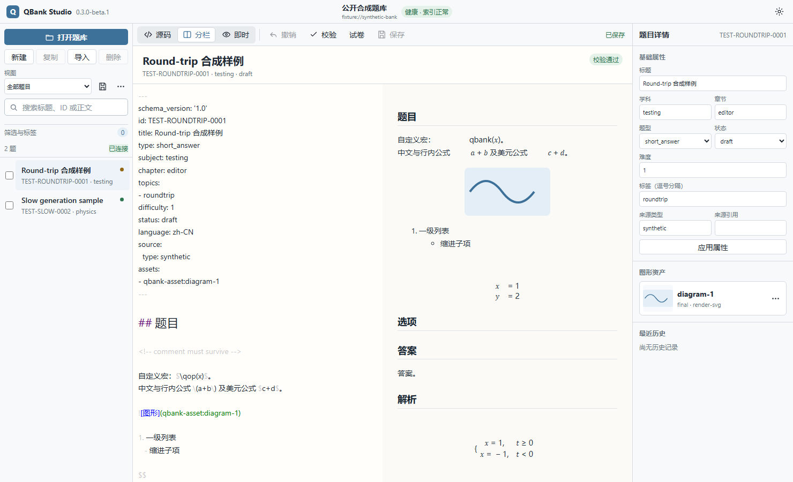
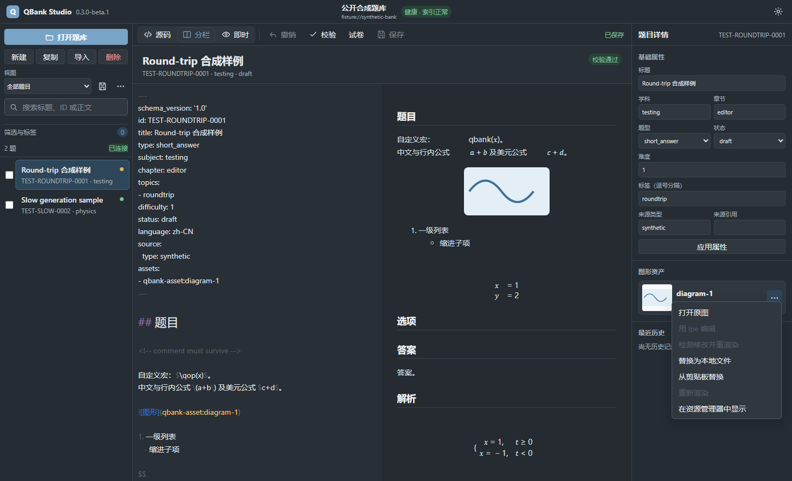

# QBank Studio 桌面编辑器

[English](../en/desktop-editor.md) · [中文文档](README.md)

## 产品边界

QBank Studio 是 qbank 的默认桌面入口，也是 `apps/studio/` 下的现代 Tauri presentation
adapter。它通过 Studio Protocol `1.0` 与本地 `qbank.studio_sidecar` 通信，并复用 CLI 和
MCP 所使用的应用服务、项目锁、事务、校验、历史与索引策略。Markdown 题目和逻辑资产仍是
权威数据；Studio 不维护另一套题库格式。

当前预发布界面版本为 `0.3.0-beta.1`，Python 包版本为 `0.3.0b1`，Question、Asset 和
Paper Schema 均为 `1.0`。Windows 安装器尚未代码签名，运行前应按照
[安装与升级指南](installation.md)核对 Release 中的 SHA-256。

<picture>
  <source media="(prefers-color-scheme: dark)" srcset="../assets/readme/studio-main-dark.png">
  
</picture>

上图来自公开合成 fixture，不包含真实考试内容、用户数据或本机绝对路径。

## 工作区结构

Studio 使用稳定的三区域文档编辑布局：

- 顶栏显示产品版本、当前题库身份、仓库健康状态和主题切换；
- 左侧导航提供打开题库、新建、复制、导入、删除、保存视图、搜索、筛选、标签和题目列表；
- 中央工作区包含文档操作栏、题目身份、校验状态，以及源码、分栏和即时渲染三种编辑模式；
- 右侧 Inspector 编辑基础属性，并显示逻辑资产与最近历史；窗口较窄时 Inspector 自动隐藏，
  以保证编辑区可用宽度。

题库路径用于确认当前工作位置，界面会在空间不足时截断显示。README 截图使用
`fixture://synthetic-bank`，不展示维护者或用户的本地目录。

打开题目与批量选择是两个独立状态。打开题目不会自动加入批量操作；批量选择必须通过题目行
复选框明确完成。当前题目即使不属于筛选结果，也会保持打开，避免打断尚未保存的编辑。

## 编辑、校验与保存

中央编辑器以 Markdown/TeX 源码为权威缓冲区。Vditor、MathJax 和预览资源随应用打包，
源码、分栏和即时渲染模式均可离线使用。原始 HTML 继续禁用；预览位于隔离 frame 中，不会
反向改写 Markdown。

dirty 状态、保存按钮、源码快照、Inspector 和预览 generation 保持同步。保存和属性更新由
sidecar 先生成 dry-run，再执行同一权威事务。提交成功后运行校验与索引同步；索引失败不会
回滚已提交的 Markdown 和历史，而会标记索引 dirty，并要求执行：

```powershell
qbank index rebuild --format json
```

多文件权威操作失败时回滚已暂存变化。补偿失败作为附加诊断报告，不遮蔽原始提交错误。

## 搜索、筛选与保存视图

搜索读取可重建的 SQLite 索引，并使用 generation token 防止旧结果覆盖新输入。保存视图是
可编辑的可见筛选快照，不会在控制器中叠加隐藏条件。字段分面、包含或排除标签、AND/OR
模式和筛选芯片共同描述当前结果；清除操作一次性恢复“全部题目”。

“需要重绘”和“当前试卷”等特殊视图只定义成员范围，仍可与可见筛选组合。筛选芯片在紧凑
导航栏中自动换行，所有条件均可逐项移除。

## 逻辑资产

资产卡片显示首选表示、状态、缩略图和能力菜单。菜单固定呈现以下操作，并根据资产的真实
能力启用或禁用：

1. 打开原图；
2. 使用 Ipe 编辑；
3. 检测修改并重新渲染；
4. 替换为本地文件；
5. 从剪贴板替换；
6. 重新渲染；
7. 在资源管理器中显示。



本地资源只有在位于题库 assets 边界内且实际存在时才会加载。HTTP/HTTPS 资源保持只读并
产生 warning；绝对路径、非法 URI 和越界路径不会被读取。Ipe 编辑采用版本化工作副本，
源表示变化后派生渲染会标记为 stale，重新渲染必须显式执行。

拖到现有图片上会请求替换；拖到允许插入的编辑区域会创建逻辑资产并写入稳定引用。未保存
源码遇到资产操作时，Studio 要求保存、放弃或取消；只有保存成功或明确放弃后才继续。

## 主题与可访问性

浅色和深色主题由 Tauri 前端的同一组语义 CSS token 驱动，并同步覆盖导航、Vditor、隔离
预览、Inspector、菜单、状态和对话框。预览在深色主题中保留浅色纸张表面，以维持公式和
文档内容的稳定对比度。

按钮、菜单和表单提供可访问名称、键盘焦点、tooltip 和明确禁用状态。视觉验收以当前 Tauri
组件为准，在 100% 与 125% 缩放下检查两种主题；Qt Legacy 截图不得用作当前 Studio 的
README 或功能证据。详细规则见 [Studio 设计系统](../ui/design-system.md)。

## QBank Studio Legacy

`qbank desktop` 启动保留的 Qt 客户端 QBank Studio Legacy：

```powershell
pip install "qbank[desktop]"
qbank desktop
```

Legacy 与现代 Studio 读取同一题库格式，但只接受数据丢失、安全或严重兼容性修复。它不是
默认桌面入口，也不代表现代 Studio 的界面和交互。两者之间不需要题库迁移。

## 开发与验收

```powershell
python scripts/check.py fast --scope studio
Set-Location apps\studio
npm ci
npm run tauri dev
npm run test:browser
```

README 截图由浏览器验收中的生产组件和公开合成 fixture 确定性生成；真实安装器仍需进行
最小启动与题库打开 smoke。Studio 当前不提供内嵌聊天、OCR、在线考试系统或模型 SDK。
版本与平台限制见 [0.3.0-beta.1 已知限制](known-limitations-0.3.0-beta.1.md)。
