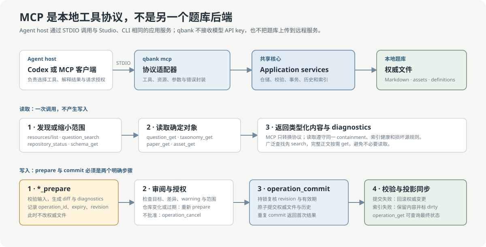

# qbank MCP 使用指南

[English](../en/mcp-guide.md) · [中文文档首页](README.md) ·
[Codex 与 MCP 接入](codex-integration.md)

## MCP 在 qbank 中解决什么问题

MCP 让支持该协议的 agent host 以类型化工具和资源访问本地题库，而不必解析终端文字或直接
修改 Markdown。它是 `qbank` 应用核心的本地 STDIO 适配器，不是远程服务、同步服务或第二个
题库后端。

- 题库内容仍保存在本机文件系统；
- MCP 进程只绑定一个明确的题库根目录；
- qbank 不需要模型 API key，也不会代表 agent 上传题库；
- Studio、CLI 和 MCP 复用相同的 Schema、校验、锁、事务、历史与索引策略；
- Skill 负责告诉 agent 何时、为何以及在何种授权下调用工具，MCP 负责执行确定性操作。



## 何时使用 MCP

以下情况适合使用 MCP：

- agent host 已支持本地 STDIO MCP；
- 需要发现 Schema、搜索题目、读取结构化记录或执行多步受控写入；
- 希望工具参数、返回类型和错误码由协议描述，而不是从命令行文本中推断；
- 任务会跨多次工具调用，且需要持久化的 prepare/commit 状态。

以下情况直接使用 CLI 更简单：

- shell 脚本、CI 或一次性批处理；
- host 不支持 MCP；
- 需要完整命令行帮助、文件管道或人工终端操作。

MCP 是可选入口。没有安装或注册 MCP 时，CLI、Studio 和仓库 Skill 仍可独立工作。

## 安装与项目注册

在安装 qbank 的同一个 Python 环境中加入 MCP 依赖：

```powershell
pip install "qbank[mcp]"
```

进入目标题库根目录，先预览配置变化，再正式注册：

```powershell
qbank codex install-mcp --project --dry-run --format json
qbank codex install-mcp --project --yes --format json
qbank codex mcp-check --format json
qbank codex integration-status --format json
```

注册只维护当前题库 `.codex/config.toml` 中带 `qbank-mcp` 标记的区块。配置使用当前 Python
解释器启动：

```text
python -m qbank mcp --repository <绝对题库根目录>
```

绝对路径由安装命令生成，用于将服务固定到一个题库；不要把该配置复制到另一台机器。更新
路径或 Python 环境时重新运行 dry-run 和安装。若已存在未受管的
`[mcp_servers.qbank]`，安装会以冲突失败，不会覆盖用户配置。

## 工具与资源

### 读取工具

| 目标 | 工具 | 典型用法 |
| --- | --- | --- |
| 仓库健康 | `repository_status` | 读取题目数、索引状态和 `repository_revision` |
| 数据契约 | `schema_get` | 读取 Question、Paper、Patch 或 Asset Schema |
| 候选发现 | `question_search` | 文本搜索或结构化筛选，返回受限结果集 |
| 完整题目 | `question_get` | 已知 ID 后读取一条权威记录 |
| 校验 | `question_validate` | 校验单题或整个题库 |
| 标签 | `taxonomy_get` | 读取 taxonomy、别名和标签定义 |
| 资产 | `asset_get` | 读取逻辑资产 manifest，不打开或下载文件 |
| 试卷 | `paper_get` | 读取受管目录内的试卷定义 |
| 操作状态 | `operation_get` | 查询 prepare、commit、cancel 或重启后的状态 |
| 试卷历史 | `paper_history_get` | 读取追加式试卷历史 |

广泛发现时先调用 `question_search`，确定 ID 后再调用 `question_get`。这可以避免一次读取大量
完整正文，也与 qbank 的索引和损坏源诊断边界一致。

### 资源

MCP 暴露 8 个只读 URI：

```text
qbank://repository/info
qbank://schema/question
qbank://schema/asset
qbank://schema/paper
qbank://taxonomy
qbank://question/{id}
qbank://paper/{id}
qbank://history/{id}
```

资源适合由 host 展示或附加到上下文；工具适合带参数的查找、校验和操作。两者读取同一应用
服务，不是两份数据。

### 写入工具

写入能力分为三类：

1. `ingest_prepare`、`patch_prepare`、`tag_change_prepare`、`paper_prepare`、
   `asset_ingest_prepare`、`asset_status_prepare`、`asset_preferred_prepare` 只准备变更；
2. `operation_commit` 提交一项仍有效且仓库版本未变化的操作；
3. `operation_cancel` 明确放弃未提交操作。

prepare 返回至少包括：

- `operation_id`：后续查询、提交或取消所需的标识；
- `repository_revision`：准备时的仓库版本；
- 过期时间；
- 确定性差异、诊断和受影响范围；
- 当前阶段不修改权威文件的确认。

提交前必须检查目标、差异、warning 和授权范围，并把 prepare 返回的原始
`repository_revision` 传给 `operation_commit`。只要仓库在两步之间变化，commit 就会拒绝；
调用方必须重新读取并 prepare，不得绕过版本检查。

## 一个完整的 agent 流程

### 只读查询

1. 调用 `repository_status` 确认目标题库与索引健康；
2. 调用 `schema_get` 了解字段；
3. 调用 `question_search` 缩小候选；
4. 只对确定候选调用 `question_get`；
5. 将结论与题目 ID、来源和未确认项一起返回用户。

### 结构化修订

1. `question_get` 读取当前记录；
2. `patch_prepare` 提交受控 patch；
3. 展示差异、diagnostics、`operation_id` 和 revision；
4. 获得明确授权后调用 `operation_commit`；
5. 用 `operation_get` 检查最终状态，并用 `question_validate` 验证结果；
6. 若用户拒绝，调用 `operation_cancel`。

响应丢失时不要再次创建相同写入。先用 `operation_get` 查询原 operation；重复 commit 会返回
首次提交结果，不会重复写入。

## 状态、错误与恢复

| 状态或现象 | 含义 | 恢复方式 |
| --- | --- | --- |
| `registered: false` | 当前题库没有 MCP 配置 | 重新执行注册 dry-run 与安装 |
| `sdk_available: false` | 当前 Python 环境未安装 MCP extra | `pip install "qbank[mcp]"` |
| `codex_cli_available: false` | 外部 Codex CLI 不可执行 | 不影响支持项目配置的 Desktop/IDE host |
| `DEGRADED` | 部分可选接入缺失 | 查看 `integration-status` 的独立状态 |
| revision changed | prepare 后题库发生变化 | 放弃旧 operation，重新读取并 prepare |
| operation expired | 审阅窗口已过期 | 重新 prepare |
| index dirty/unavailable | 全文搜索投影不可用 | 通过 CLI 执行 `qbank index rebuild --format json` |
| server response lost | 不确定 commit 是否完成 | `operation_get` 查询持久化状态 |

MCP 的结构化错误保留 qbank 稳定诊断码。不要根据自然语言错误字符串决定是否重试；优先检查
错误码、operation 状态和仓库 revision。

## 安全边界

- STDIO 服务只接受启动时绑定的题库根目录，不提供任意路径参数；
- 读取操作不会创建索引、目录或 dirty marker；
- prepare 被标记为只读，不修改权威文件；
- commit 在仓库级跨进程锁内复核 revision、有效期和输入；
- operation 状态保存在 `.qbank/mcp-operations/`，只记录受控意图与恢复所需状态；
- MCP 不启动 Ipe、浏览器、Studio 或任意本地程序；
- 外部资源不会被自动下载；
- 来自非 qbank 项目的源文件默认只读；
- 未确认答案、来源或分类必须保持 `draft`，不得由 agent 补写为事实。

## 当前限制

- 只提供本地 STDIO transport，不提供 HTTP、远程托管或订阅；
- 不提供 Studio 内嵌聊天、模型封装、账号或 API key 管理；
- 配置示例首先由 qbank 自身生成；更多 MCP agent host 的安装模板与互操作测试仍在
  [路线图](roadmap.md)中；
- MCP 不负责 OCR。轻量工作流复用来源项目已有的 MinerU 输出，由 AI 与
  `$qbank-digitize` 生成 Question JSONL、Asset packages 和只含不确定项的
  `review.md`，再交给现有 MCP 两阶段写入与验证。

机器权威能力清单见[能力矩阵](../features/capability-matrix.md)；Skill、跨项目授权与
`$qbank-digitize` 的职责见[Codex 接入指南](codex-integration.md)。
