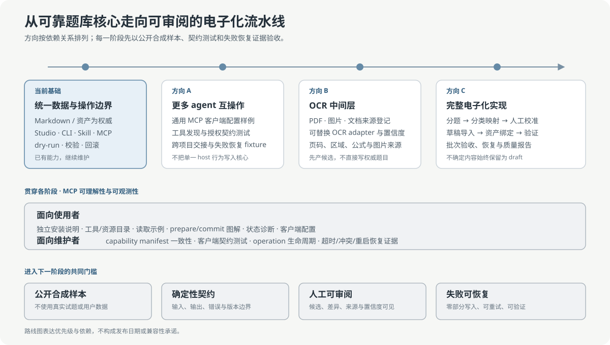

# qbank 路线图

[English](../en/roadmap.md) · [中文文档首页](README.md)

本路线图描述 `0.3.x` 之后的优先方向与依赖关系，不承诺发布日期。任何方向进入实现前，都要
建立独立 feature 文档或 issue 摘要，并按[功能生命周期](../feature-lifecycle.md)完成设计、
双语文档、测试、兼容性与限制说明。

## 当前基础

qbank 已经具备继续扩展所需的数据边界：

- Markdown 题目、逻辑资产和项目定义是权威文件；
- Studio、CLI、Skill 和可选 MCP 共用一个应用核心；
- 写入采用 dry-run、revision、仓库锁、事务、历史与失败恢复；
- `$qbank-digitize` 可以在真实电子化项目开始前形成字段策略、分类映射和代表样本；
- 当前公开示例和测试不包含真实试题或用户数据。

当前版本不包含 OCR 引擎，也不把 OCR 文本直接写入权威题目。

## 方向 A：更多 agent 与 host 的支持测试

目标不是把某个 agent 产品写进 qbank 核心，而是验证不同 host 能否正确理解同一契约。

计划内容：

- 为通用 STDIO MCP host 提供最小项目配置与故障排查样例；
- 建立工具发现、Schema 读取、资源读取和两阶段写入契约测试；
- 覆盖授权缺失、operation 过期、revision 冲突、响应丢失和 server 重启；
- 建立跨项目上下文 handoff fixture，验证目标题库、来源和写入权限不会丢失；
- 记录经过实际验证的 host、版本、操作系统与限制，未验证项不宣称支持。

验收重点是协议与数据安全，不是为每个 host 复制一套业务逻辑。

## 方向 B：文档、图片与 PDF 的 OCR 中间层

OCR 属于来源适配与候选生成阶段，不属于 qbank 权威仓储。计划中的中间层应包含：

- 来源包：文件哈希、文档类型、页码、区域和许可/授权说明；
- 可替换 OCR adapter：不把单一云服务或本地引擎绑定为核心依赖；
- 候选块：原文、识别文本、置信度、版面区域、公式、表格和图片引用；
- provenance：每个字段能够追溯到页码或区域，并区分原文与推断；
- 分类映射：把项目自有分类表规范化为 qbank subject、chapter、topics 或忽略策略；
- 校准批次：先审阅有代表性的少量页面，再批准大批处理；
- 不确定性规则：低置信度、缺答案、边界不明或来源不完整时保持候选或 `draft`。

OCR adapter 只能输出候选交换数据，不得直接创建 `questions/**/*.md` 或写逻辑资产目录。

## 方向 C：完整电子化实现

完整实现应把现有 `$qbank-digitize` 决策流程与候选中间层连接成可恢复流水线：

1. 注册来源与授权；
2. 解析页面并生成 OCR/版面候选；
3. 识别题目边界、子问、选项、答案、公式、表格和图片；
4. 应用经批准的字段与分类策略；
5. 进行人工样本校准和批次质量检查；
6. 生成 qbank JSON/JSONL 与资产包；
7. 通过 `$qbank` 或 MCP prepare 预演；
8. 审阅差异后提交为 `draft` 或已确认状态；
9. 执行验证、重复检测、来源完整性检查和批次验收；
10. 保留可重试状态、失败报告与恢复路径。

需要单独验证中文/英文混排、数学公式、跨页题目、扫描噪声、复杂表格、图题绑定和答案册对齐。
在这些证据完成前，不把“PDF 一键入库”作为产品能力。

## 贯穿方向：MCP 可理解性与可观测性

MCP 改进与 agent 测试、OCR 和电子化流程并行推进：

- 维护独立的[MCP 使用指南](mcp-guide.md)；
- 从 capability manifest 生成或校验工具、资源和访问级别说明；
- 为常见 host 提供经过验证的配置，不维护未经测试的复制粘贴片段；
- 让 operation 生命周期、revision、expiry、warning 和恢复动作在 host 中可见；
- 使用公开合成题库运行客户端契约和重启恢复 smoke；
- 保持 MCP 为可选本地适配器，不让 CLI、Studio 或数据格式依赖特定 agent。

## 共同完成标准

一项路线图能力只有在满足以下条件后才可标记为 implemented：

- 有用户目标、边界、失败行为、兼容性与迁移结论；
- 有中文和英文用户文档；
- 有公开合成 fixture，不含真实试题、路径或用户数据；
- 有确定性的 Schema、错误码或 Protocol 契约；
- 有正常、冲突、取消、超时和恢复测试；
- 数据来源和 AI/OCR 推断可区分；
- 不确定内容不会被静默提升为已确认事实；
- README、CHANGELOG、能力矩阵、Skill 和已知限制按实际影响同步。
